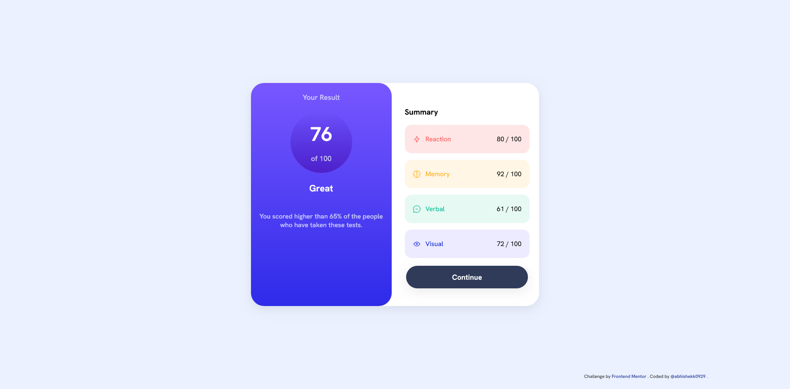

# 📊 Results Summary Component

This is my solution to the [Results Summary Component challenge on Frontend Mentor](https://www.frontendmentor.io/challenges/results-summary-component-CE_K6oiau).  
Live Demo: [https://abhishekk0929.github.io/results-summary-component-main/](https://abhishekk0929.github.io/results-summary-component-main/)

---

## 📸 Screenshot

<!-- Replace with your actual screenshot file path if available -->

---

## 🔗 Links

- **Live Site:** [https://abhishekk0929.github.io/results-summary-component-main/](https://abhishekk0929.github.io/results-summary-component-main/)
- **Frontend Mentor Challenge:** [Results Summary Component](https://www.frontendmentor.io/challenges/results-summary-component-CE_K6oiau)

---

## 🛠️ My Process

### 🧰 Built With

- Semantic HTML5 markup
- CSS custom properties
- Flexbox for layout and alignment
- Linear gradients for backgrounds
- Mobile-first workflow
- Responsive design with media queries

### 🚀 What I Learned

- How to use Flexbox to create responsive card layouts
- Implementing linear gradients for attractive backgrounds
- Using CSS custom properties for easy color management
- Creating visually appealing summary sections with icons and color coding
- Improving accessibility with semantic HTML and proper alt text

---

## 📈 Continued Development

- Further explore advanced CSS Flexbox layouts
- Practice more with desktop media queries and browser compatibility
- Improve accessibility and ARIA usage

## 📚 Useful Resources

- [Frontend Mentor Help Center](https://www.frontendmentor.io/help)
- [CSS Tricks: A Complete Guide to Flexbox](https://css-tricks.com/snippets/css/a-guide-to-flexbox/)
- [MDN Web Docs: CSS Flexbox](https://developer.mozilla.org/en-US/docs/Web/CSS/CSS_flexbox)

## 👤 Author

- Frontend Mentor - [@abhishekk0929](https://www.frontendmentor.io/profile/abhishekk0929)

---

## 🙏 Acknowledgments

Thanks to the Frontend Mentor community for feedback and inspiration, and to everyone who shares helpful CSS and HTML resources online!
